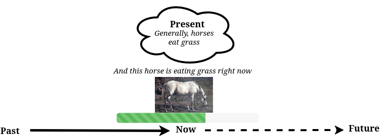

# Aspect

_Aspect_<sup>[wiki](https://en.wikipedia.org/wiki/Grammatical_tense)</sup> expresses
how an event is composed with the flow of time. 

**Prerequisites**: To correctly form these structures, you'll first need to understand
how to conjugate the present and past simple, especially for the verbs "to do,"
"to have," and "to be." You'll also need to learn the present participle[(i.e.
the "-ing" form°)](https://www.grammar-monster.com/glossary/present_participle.htm)
and the past[(i.e. "verb 3" form°](https://englishstudyhere.com/verbs/50-examples-of-present-tense-past-tense-and-past-participle/) participles.

## Aspect creates texture in time 

In our examples of the [present and past simple](./tense.md), the events have no real composition
in the flow of time. Saying "the horse eats grass," or "Gennady Golovkin is a
boxer," are always true, which in turn means that they don't have any particular
event. Furthermore, although "the horse ate the grass" expresses a particular event,it has no
specific composition across time; we know only that an event happened, we have
no idea how long the event occured. For example, we don't know

* How the action extended in time
* Whether it had a relation to another action
* Whether it was a habitual or one time event,

Fortunately, it's absolutely possible to express all of these things through
grammar. For that, we have aspect. 

This section specifically focuses on the ongoing, or the _continuous aspect_ 
and the relaion, or _perfect aspect_. This is for two reasons. First, these
aspects are by far the most common. Second, they serve as building blocks
for future sections, and accomodating the habitual aspect would wreck my whole
theory.

## The continous aspect describes ongoing activity

While the present simple speaks about general states, the present continuous
speaks about ongoing states. For example, "horses eat grass" tells a factual
statement about the dietary habits of all horses, at all times. On the other
hand, "the horse is eating grass", speaks about the action of a particular horse. 
And because it's in the present tense(form covered at the end of this section), it speaks about a particular action of the
horse "right now"(relative to the universe my diagram). By the way, there's a special name for a structure that has a present
tense and a continuous aspect. You guessed it: the _present perfect continuous._



It's important to mention that, although my horse sentence does seem to be talking
about "right now," right now is not the only context of the present continuous.
The present continuous just needs to describe an action that's in process, not
necessarily one that's occuring at exactly at that moment. For example, if someone
says "I'm reading a book about swimming pools," it doesn't mean that person is
reading a book about swimming pools at that very moment of speaking. Actually it
seems impossible─how can you read and speak at the same time? What the person
means is that the activity is ongoing. This is important enough that I'll summarize
myself one more time: the continuous aspect is about activity.

Now if we can have a present continuous, can't we have a past continuous? Of course!
**Aspect and tense are independent of each other. They can always be combined.**
To make the correct combination, you just have to know the right form:

```markdown
Subject    + verb to be + present participle
The horse    is           eating              

I            was        reading                
```

Now, remember order of operation #1:

>
