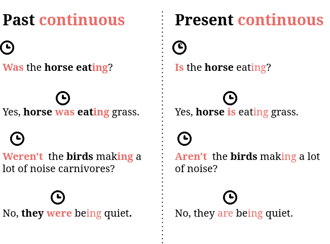

# Aspect

_Aspect_<sup>[wiki](https://en.wikipedia.org/wiki/Grammatical_tense)</sup> expresses
how an event is composed with the flow of time. My aspect section is broken
into two parts. This page describes the continuous aspect. [The next page](perfect-aspect.md)
goes over the perfect and the perfect continuous aspects.

**Prerequisites**: To correctly form these structures, you'll first need to understand
how to conjugate the present and past simple, especially for the verbs "to do,"
"to have," and "to be." You'll also need to learn the present participle[(i.e.
the "-ing" form°)](https://www.grammar-monster.com/glossary/present_participle.htm)
and the past (i.e. "verb 3" form)[°](https://englishstudyhere.com/verbs/50-examples-of-present-tense-past-tense-and-past-participle/) participles.

## Aspect creates texture in time 

In our examples of the [present and past simple](./tense.md), the events have no real composition
in the flow of time. Saying "the horse eats grass," or "Gennady Golovkin is a
boxer," are always true, which in turn means that they don't have any particular
event. Furthermore, although "the horse ate the grass" expresses a particular event,it has no
specific composition across time; we know only that an event happened, we have
no idea how long the event occurred. For example, we don't know

* How the action extended in time
* Whether it had a relation to another action
* Whether it was a habitual or one time event.

Fortunately, it's absolutely possible to express all of these things through
grammar. For that, we have aspect. 

This section specifically focuses on the ongoing, or the _continuous aspect_ 
and the relation, or _perfect aspect_. This is for two reasons. First, these
aspects are by far the most common. Second, they serve as building blocks
for future sections, and accommodating the habitual aspect would wreck my whole
theory.

## The continuous aspect describes ongoing activity

While the present simple speaks about general states, the present continuous
speaks about ongoing states. For example, "horses eat grass" tells a factual
statement about the dietary habits of all horses, at all times. On the other
hand, "the horse is eating grass" speaks about the action of a particular horse
at a particular time. 
And because it's in the present tense(form covered at the end of this section),
that particular time is "right now"(relative to the
universe my diagram). By the way, there's a special name for a structure that
has a present tense and a continuous aspect. You guessed it: the _present
perfect continuous._


It's important to mention that, although my horse sentence does seem to be talking
about "right now," right now is not the only context of the present continuous.
The present continuous just needs to describe an action that's in process, not
necessarily one that's occurring at exactly at that moment. For example, if someone
says "I'm reading a book about swimming pools," it doesn't mean that person is
reading a book about swimming pools at that very moment of speaking. Actually it
seems impossible─how can you read and speak at the same time? What the person
means is that the activity is ongoing. This is important enough that I'll summarize
myself one more time: the continuous aspect is about activity.

Now if we can have a present continuous, can't we have a past continuous? Of course!
**Aspect and tense are independent of each other. They can always be combined.**
To make the correct combination, you just have to know the right form:

```markdown
Subject    + verb to be + present participle
The horse    is           eating              

I            was        reading                
```

When you want to set a continuous sentence's tense, don't forget order of operation #0:

> **RULE 0: The time and subject of a sentence is marked by the verb closest to the left of the subject.**

So, what's the verb closest to subject? In this case, it's the `verb to be`. So
if you want to put a sentence in the continuous present, use `Subject + [am][is][are]`, depending
on what form of the `verb to be` agrees with the subject.

* I'm running
* Are you really running?
* No not really. It's raining.

Now these are all present tense. How about the past?


## The past continuous: same construction, only past tense.


In the case of the _past continuous,_ use the structure `subject + [was][were]`, again, depending
on what form of the `verb to be` agrees with the subject. How could we make the
dialogue in the section above in the past tense? Before you check, try
to think it through. Remember: _the verb closest the left subject marks the
sentence's tense_

<details>
  <summary>
* I'm running
* Are you really running?
* No not really. It's raining.</summary>

* I **was** running.
* **Were** you really running?
* No not really. It **was** raining.
</details>

As I said, the continuous emphasizes activity. So, when we use the past continuous,
we discuss about an ongoing action that continued in the past. Very often,
the past continuous does not exist alone, but rather is anchored to another event written
in the past simple.


In other words, the horse was engaged in the action of eating before and after
the isolated event "the lightning struck." Just like the present continuous, the
action doesn't have to be occurring at exactly that moment. Rather, it just needs
to be an ongoing activity. Consider this sentence:

> My great-great-grandfather was working as a brick-layer when Franz Ferdinand was shot.

Does this sentence mean that my great-great-grandfather was literally building a wall
of bricks when World War Started? Maybe, maybe not. What it does mean that
my great-great-grandfather was in an ongoing process of working as a brick-layer
around that time.

Note that in these sentences, the `verb to be` is not the main verb. Rather, it's
the _auxiliary_, meaning it modifies the meaning of the main verb. Functioning
as an auxiliary, the `verb to be` ends up modifying the verb to
the left of it. This is a good time to introduce Rule 1.

## Rule 1. The auxiliary always modifies the verb to the left of it.

In the case of this page, the `verb to be` marks the continuous aspect. The
continuous means "ongoing", which is denoted by the `ing` form. So whether the verb's
in the present or the past, singular or plural, or first, second, or third person,
the continuous aspect will always contain the `verb to be` followed by the `ing`.
However, the `verb to be` is just an example, Rule 1 covers all uses of auxiliaries.



There are two kinds of auxiliaries, the "normal" auxiliaries, comprised of verbs
which also can function as normal verbs─`to do`, `to have`, and `to be`─and the
_modal_ auxiliaries, which really function only as auxiliaries, never as main
verbs─e.g. `will`, `can`, `might`, `shall`, `may`. No matter what kind of
auxiliary verb, it will always modify the verb to the left of it. This
will be very important as you create constructions that involve multiple modals
or aspects (the first example occurs on the next page).

-----

Up next, [the perfect aspect](./perfect-aspect.md

