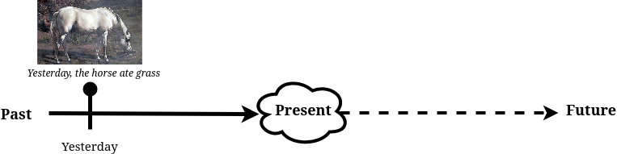

# Tense and Aspect

*Tense*<sup>[wiki](https://en.wikipedia.org/wiki/Grammatical_tense)</sup> is 
the time when an action occured.
*Aspect*<sup>[wiki](https://en.wikipedia.org/wiki/Grammatical_aspect)</sup> is
how an action extends over time.

The tenses are the present, past, and the future. There are actually many ways
to add aspect to a sentence, but I'm going to focus on the two main aspects:
the perfect and the continuous.

# Tenses mark the present and the past

**prerequisites:** None. If you can read this sentence, you're good. However,
to accurately construct past tenses, you will need to [memorize](../tools.md#spaced-repition)
the irregular past forms[°](https://grammar.cl/Past/Irregular_Verbs_List.htm).

## The present simple speaks about always


**Present simple**

Really there are only two tenses in English: the present and the past. These
topics are probably pretty basic for most of my audience, so I'll go quickly.
This picture shows the dimension of time, devoid of all events:


Although we think of the present as the "right now," in it's _simple_ form,
the present refers to things that are generally and permanently true.


What this sentence implies is a general truth about the horse's eating habits.
What it doesn't imply is whether the horse is eating at the moment.

There are two forms of the present simple sentences: sentences that don't have the verb "to be" and sentences that do.
Sentences with the verb "to be" differ from other sentences in three ways

* Their conjugation (see link here[°](https://www.thoughtco.com/present-and-past-forms-verb-be-1690359))
* Their negative form─negative sentences with regular verbs use `do not + $VERB` (e.g. "I do not know"in the negative structure`do/does + not + $VERB`;negative sentences with the verb "to be" uses only "not":
`I/you/it + am/are/is + not`
* Their interrogative form-questions with normal verbs begin with do("Do you know me");
questions with the verb "to be" begin with the verb itself ("Are you sure?")

Because the present simple is the kernel around which all other sentences 
are constructed, getting these down is very important. The verb to be is doubly
important, as it's the basis of the continuous aspect. But before we get to that,
let's look at the past simple.

## The past simple speaks about finished events

However, while the present simple typically refers to a persistent event, the
past simple normally refers to an event that's finished in time. For example,
this event is fixed to a specific time, "yesterday".

>Yesterday, the horse ate.

 

The key features of the past simple are that:

* The action is in the past (duh)
* The action is not ongoing

Although its past simple can refer to a habitual event(e.g. "The milkman came
on Monday") it usually refers to a single, finished event. This is because we
have other was to mark the habitual past (we'll get to them).

If they are both simple, why does the present simple refer to a general moment
and the past simple refer to a specific moment? I don't know the answer to that.
However, I have a few ideas. One, it's impossible to use the present tense
to denote a finished action; finished implies over. So that leaves only two
possible present events: the generally true, and the ongoing. Well, we have 
a special aspect for the ongoing, which leaves only the generally true left.

## Presenting the 0th order of operation


As I said, the present simple is the kernel from which all grammatical structures grow. In
the case of the past simple, the syntax is the exact same. The only change is
the verb form, which changes from present to past. As with the present simple,
the past simple's questions
and negatives are indicated by the _auxiliary verb_. When
a sentence has an auxiliary, it is the auxiliary, not the main verb, that agrees
with the subject. It is also the auxiliary that marks the sentence's time.

**Important:** 

The auxiliary marks time, and agrees with the subject.
This holds true even in more complex sentences and with more auxiliaries. But
the tense is always marked by one auxiliary, one alone. So how do you know which one?

Now is a good time to introduce our 0th order of operation:

**RULE 0: The time and subject of a sentence is marked by the verb closest to the left of the subject.**


Take a look at the diagram. Rule 0 is true, no matter whether the sentence
is positive or negative, interrogative or declarative, or with a normal verb 
or the verb to be. As we continue, you will see that, no matter the sentence complexity,
**rule 0 is always true**.

## Hey! What about the future?

Unlike the past and the present, the future tense in English has no verb inflection.
For this reason, there's some controversy about whether or not it's really a tense.
While this is an interesting topic for linguists, it's probably not very important
for English learners or ESL teachers. So lets get to it:

The future usually formed in two ways:

* With the modal "will" plus the bare verb:

```Markdown
The Horse   will   eat grass
{{SUBJECT}} + will + {{VERB}}

```

* With the verb to be + going + infinitive

```markdown
The horse       is     going       to eat grass
{{SUBJECT}} +   {{VTB}} + Going to + {{INFINITIVE}} 
```

These are not the only ways to discuss the future, but they are the two main ways.
Actually, I'm going to skip discussion about the future for now, because construction involves
a [modal verb](#modals.md) and the other involves the [continuous aspect](#aspect.md).
So I think it'd be better to return to the future after I've presented those
to topics.

What I'd like to point out is the difference between these two futures.
In theory, "Going to" marks the *planned future* and "will" marks the
_spontaneous future and the planned future._
In the vast majority of cases, the constructions have almost the same meaning.
However, sometimes "going to" does sound wrong. Here's the example I use:

>You and your friends are watching Football. Someone knocks on the door. The owner of the house is speaking on the phone, so he looks up to his friends and says "Sorry, can someone get that?"
> You must decide which future to use.

<details>
  <summary>I'm going to do it</summary>

Your friends all think *WTF, when?* That's because it sounds like you're
making a plan for the future.

</details>

<details>
  <summary> I'll do it </summary>

*Hooray!* your friends think. That's because it sounds like you will open the
door in the immediate future. This means they won't have to, and they are lazy.
</details> 

------------------

Up next: Aspect. It's time to add some texture to time. 
